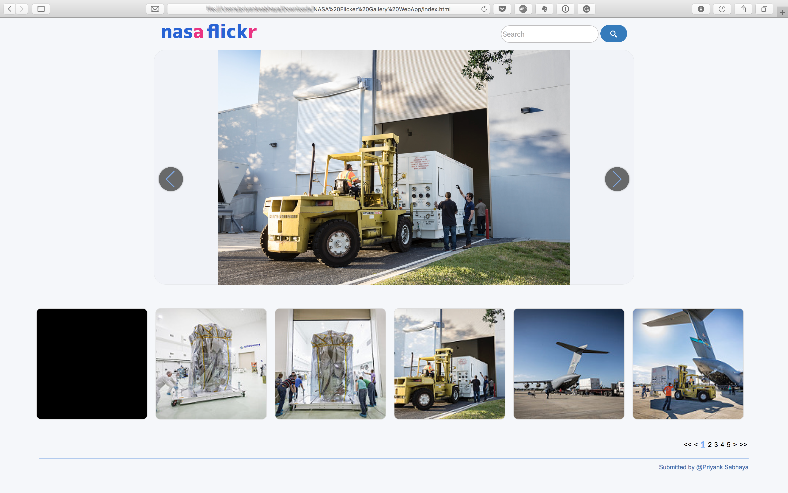

# NASA's Flickr gallery WebApp

- This project is the demo I've developed as a part of an IBM Front-End exercise.
It uses Flickr API to develop NASA's Flicker gallery to display to display my design thinking.
- You can search for images within NASA's Gallery.
- Hover effect on thumbnails pops up a tooltip which shows the title of the image posted on flicker.

- Developed using Pure HTML, CSS and JS. I haven't used any nodejs technologies to keep it simple and sleek.

- Hosted on GitHub Pages: https://priyanksabhaya.github.io/NASA-Flickr-Gallery-WebApp/

